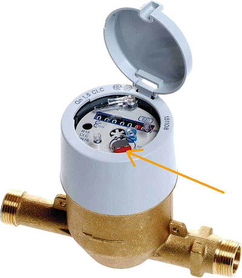

# ESPHome Water Meter

Read this in other languages: [French](README.fr.md)


## Presentation

If you have a water meter (Sensu R-315 for my part), it may have an indicator allowing you to know the current consumption fairly accurately.
Its operation is quite simple, a disc (see photo) visible in the dial of the meter rotates at a speed proportional to the flow of circulating water.
It is designed so that each complete revolution corresponds to 1L of water.

The disc consists of a reflective part and a matt part (see photo below), so, by using an adapted sensor, it is possible to detect the rotation of the disc and thus to deduce the current consumption of your meter.



In order to detect the rotation of the disk, I used a sensor [TCRT5000](docs/tcrt5000.pdf) with an IR emitting LED and a photo-transistor in the same case.
It is possible to find these sensors on stand-alone boards with an operational amplifier and an adjustable resistor for a very interesting price.

I glued the sensor on both sides with a very approximate method but it works very well, however I plan to make a 3D printable part to facilitate the installation.


## Features

### Consumption measurements

* Daily consumption
* Weekly consumption
* Monthly consumption
* Annual consumption
* Primary / secondary consumption: Meters that can be reset to 0 at any time to perform any kind of measurement.
* Current consumption: Indicates the instantaneous consumption.
* Last consumption: Indicates the last consumption (the measurement continues as long as the meter is running without interruption for more than 5 minutes).

### Status

The operating status of the meter is visible via a WS2812 LED that flashes green at regular intervals.

### Measurements

The meter being located in the cellar, I took advantage of this installation to measure the temperature and humidity via an AM3220 sensor (which I don't recommend by the way).

A light sensor (LDR) also allows me to know if the light is on in the cellar indicating a probable omission of extinction of the latter.
The brightness measurement is done at the moment the light is switched off to avoid the status LED to disturb the measurement.

## Operation

The operation is quite simple and the most important YAML part is shown below:

```yaml
binary_sensor:
  # TCRT5000 pulse counter
  # IO18 / GPIO18
  - platform: gpio
    id: water_pulse
    pin: GPIO18
    internal: true
    filters:
       - delayed_on_off: 50ms
       - lambda: |-
          id(main_counter_pulses) += x;
          id(secondary_counter_pulses) += x;
          id(daily_counter_pulses) += x;
          id(weekly_counter_pulses) += x;
          id(monthly_counter_pulses) += x;
          id(yearly_counter_pulses) += x;
          id(event_quantity) += x;
          return x;
    on_state:
       - script.execute: publish_states
```

A digital sensor is declared and uses the digital input/output 18 on which the TCRT5000 is connected.

A filter allows to suppress parasitic pulses coming from the sensor if its state is not defined during more than 50 milli-seconds.

Once the filter is passed, we land in the lambda or C code is executed and which simply consists in incrementing the global defined above.

Another part declares a pulse counter type sensor which allows to know the instantaneous consumption.

```yaml
sensor:
  # TCRT5000 pulse counter
  # IO18 / GPIO18
  - platform: pulse_counter
    id: water_pulse_counter
    name: "${friendly_name} water consumption"
    pin: GPIO18
    update_interval: 2sec
    internal_filter: 10us
    unit_of_measurement: "L/min"
    accuracy_decimals: 0
    icon: "mdi:water"
    filters:
      # Divide by 60
      - multiply: 0.0167
      - lambda: return abs(x);
```

## Files

* watermeter.yaml: The ESPHome configuration file
* network.yaml: Your network information
* secrets.yaml: The secret information about your network.
